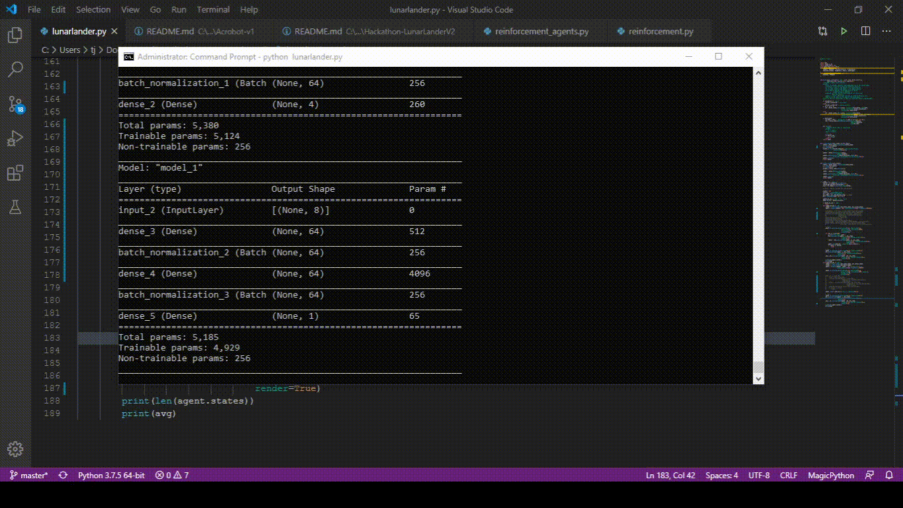

# Hackathon-LunarLanderV2
Hackathon: MLH Los Rios Hacks (4/11/2020)

Collaborators: Travis H, Maggie C

Goal: Attempt to solve (Avg. Reward of 200) LunarLander-V2 and learn more about reinforcement learning

Goal Succeed: Partly, did not solve LunarLander-V2, but did learn more about reinforcement learning

Trial 1
- Algorithm: Policy Gradients (No Critic)
- Episodes of A2C Agent (convergence episodes): 280
- Actor
  - Model: Input -> Dense(64) -> ReLu -> BatchNorm -> Dense(64) -> ReLu -> BatchNorm -> Dense(4) -> Softmax
  - Optimizer: Adam(.003)
- Agent Parameters
  - Discount Rate: .99
  - Memory: 500000
- Learning Parameters
  - Batch Size: 32
  - Mini-Batch size (Sample size from all experience): 10000
  - Epochs (Number of complete gradient steps per episode): 1
- Result: Failed 
  - Average Reward: -48

Trail 2
- Algorithm: Policy Gradients (No Critic)
- Episodes of A2C Agent (convergence episodes): 800
- Actor
  - Model: Input -> Dense(64) -> ReLu -> BatchNorm -> Dense(64) -> ReLu -> BatchNorm -> Dense(4) -> Softmax
  - Optimizer: Adam(.003)
- Critic
  - Model: Input -> Dense(64) -> ReLu -> BatchNorm -> Dense(64) -> ReLu -> BatchNorm -> Dense(1)
  - Optimizer: Adam(.01)
  - Loss: mean squared error
- Agent Parameters
  - Discount Rate (gamma): .99
  - Lambda Rate (enables GAE > 0): 0 (Disabled)
  - Memory: 500000
- Learning Parameters
  - Batch Size: 128
  - Mini-Batch size (Sample size from all experience): 1000
  - Epochs (Number of complete gradient steps per episode): 1
- Result: Failed 
  - Best 100-episode performance: 112.8

Conclusion:
We succesfully used GitHub and Google Colabs to modifiy and run code. Although we where unable to beat the game, trial 1 and especially trial 2 showed that the agents did learn somewhat how to play the game. The agent in trial 2 was able to get scores above 200, but could not do it consistently. 

Gameplay from the trial 2

